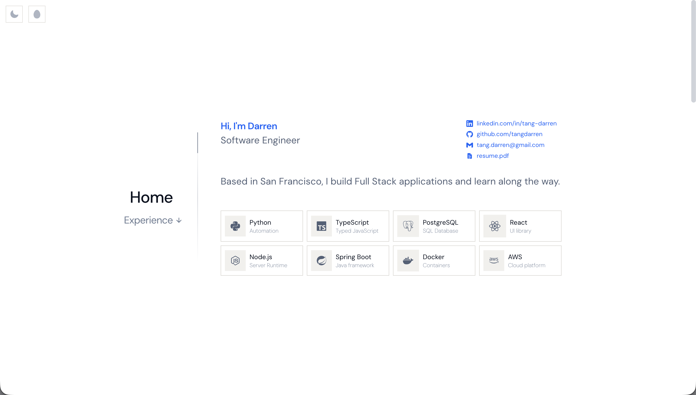

# tangdarren.com

My personal website and portfolio. A place to share who I am, what I've worked on, and what I'm learning along the way.

**[tangdarren.com](https://tangdarren.com/)**

## About

I wanted my portfolio to feel more personal than a traditional project showcase. It brings together my experience, education, projects, and the technologies I enjoy working with in one simple space.

I designed the site around a clean white canvas with soft blue accents, keeping the interface minimal so the content stays at the center. A lot of the work went into the smaller details such as typography, spacing, responsive behavior, navigation, and subtle interactions that make the site feel polished without making it feel busy.

## A Little Extra

I also wanted the site to have a bit of personality, so there are some easter eggs.

I'll leave finding it to you.
