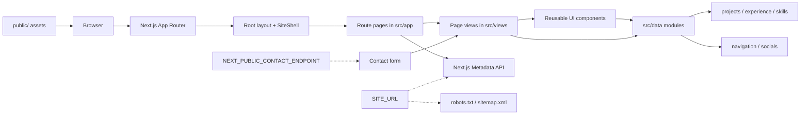

# Darren Tang Portfolio

A recruiter-facing software engineering portfolio for Darren Christopher Tang. It presents professional experience, skills, selected projects with case studies, and résumé information in a clear, navigable multi-page site built with the Next.js App Router.

## Project Overview

- **Home** — Introduction, section navigation, and featured projects with links to case studies.
- **About** — Background, education and career highlights, experience timeline, and skills.
- **Projects** — Filterable project gallery with search and sort, plus individual case-study routes.
- **Résumé** — Embedded PDF viewer with download support.
- **Contact** — Contact form and social links.

The layout is responsive, with mobile navigation and accessibility-minded markup (semantic landmarks, skip link, labeled controls, and focus management). Motion respects `prefers-reduced-motion` via Framer Motion and CSS. Portfolio content is driven from modules under `src/data/`.

## Project Preview

Screenshots of the main recruiter-facing areas of the portfolio.

### Home


The home page introduces my software engineering focus and provides direct access to projects and my résumé.

### Projects


The project gallery supports searching, category filtering, sorting, and access to individual project case studies.

### About


The About page presents my background, education, professional experience, and technical focus.

## Project Architecture



Route files under `src/app` own routing and metadata. Presentation lives in `src/views` and `src/components`. Static images and the résumé PDF are served from `public/`. Content is separated from presentation so portfolio information can be updated in the data modules without rewriting component markup.

## Tech Stack

| Area | Technology |
| --- | --- |
| Framework | Next.js App Router |
| UI | React, TypeScript |
| Styling | Tailwind CSS |
| Motion | Framer Motion |
| SEO | Next.js Metadata API, `robots.ts`, `sitemap.ts` |
| Icons | Lucide React |
| Quality | ESLint, Vitest, React Testing Library |

## Getting Started

```bash
git clone https://github.com/tangdarren/portfolio.git
cd portfolio
npm install
cp .env.example .env.local
npm run dev
```

Copying `.env.example` to `.env.local` is optional unless you are configuring the contact endpoint or overriding the site origin for local metadata testing. The Next.js development server runs at [http://localhost:3000](http://localhost:3000). Public metadata falls back to `https://tangdarren.com` when `SITE_URL` is unset.

## Available Scripts

| Command | Description |
| --- | --- |
| `npm run dev` | Start the Next.js development server |
| `npm run build` | Create a production build |
| `npm run start` | Serve the production build |
| `npm run typecheck` | Run TypeScript checks without emitting output |
| `npm run lint` | Run ESLint |
| `npm test` | Run the Vitest suite once |
| `npm run test:watch` | Run Vitest in watch mode |

## Environment Configuration

| Variable | Purpose |
| --- | --- |
| `NEXT_PUBLIC_CONTACT_ENDPOINT` | Optional URL the contact form POSTs to (JSON body: `name`, `email`, `subject`, `message`). Exposed to the browser. |
| `SITE_URL` | Optional server-only public site origin for canonical URLs, Open Graph images, `robots.txt`, and `sitemap.xml`. No trailing slash. When unset or invalid, defaults to `https://tangdarren.com` (never localhost). |

When `NEXT_PUBLIC_CONTACT_ENDPOINT` is unset, the form still validates input, then opens a `mailto:` link to `tang.darren@gmail.com` with the submitted subject and message. It does not claim a server-side send succeeded.

Do not put secret API keys in `NEXT_PUBLIC_*` variables. Use a public or publishable endpoint, or a backend proxy that keeps secrets server-side.

## Testing

The project uses Vitest and React Testing Library. Navigation-aware tests mock `next/navigation` and `next/link` lightly so page rendering, project filters, case-study links, navbar behavior, metadata helpers, and contact-form fallbacks can be exercised without spinning up the Next.js server.

```bash
npm test
```

## Deployment

The app is configured for Vercel with the Next.js App Router. Connect the repository to Vercel and deploy. Setting `SITE_URL` is optional because the app already defaults to `https://tangdarren.com`; you may still set it (and optionally `NEXT_PUBLIC_CONTACT_ENDPOINT`) in the project environment if you need an override. Vercel runs `npm run build` and serves the Next.js application; no SPA rewrite configuration is required.
